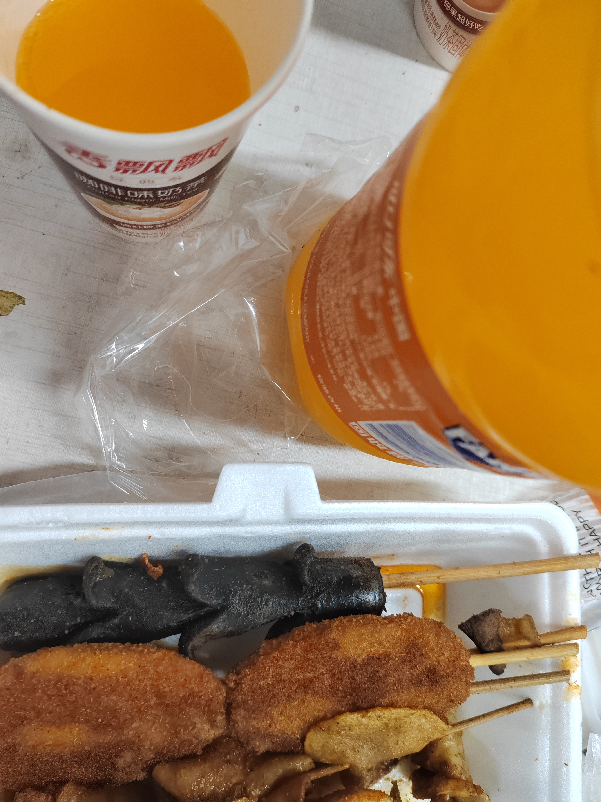



## 一、前言

随着考研周期的临近，学业压力日益加重，如何高效利用时间、平衡学习与娱乐成为了一个现实问题。

我的主力设备是一台联想小新13笔记本。由于有学习 Go 语言等开发需求，我需要开启 WSL (Windows Subsystem for Linux)，这依赖于 Hyper-V 虚拟化平台。然而，在 Hyper-V 模式下，常用的安卓模拟器（如 MuMu 模拟器）性能表现不佳，运行《碧蓝航线》等游戏时会出现明显的卡顿。这不仅影响了游戏体验，更重要的是，一个需要24小时不间断运行的 `alas` 自动化程序，会持续占用本应用于学习的电脑资源，与我希望将学习和娱乐环境彻底隔离的初衷相悖。

为了将这个7x24小时的挂机任务从我的主力学习设备中剥离，解放笔记本的性能，我决定将《碧蓝航线》及其自动化项目 `alas` 部署到一台独立的低功耗设备上。恰巧手头有一台 SRTP 项目用剩下来的树莓派5 (Raspberry Pi 5)，其强大的性能和极低的功耗完美契合了我的需求。遂决定利用它来搭建 `alas` 环境，实现《碧蓝航线》的自动化运行。

本篇博客旨在记录在树莓派5上从零开始部署 `alas` 并成功运行《碧蓝航线》的全过程，希望能为有类似需求的指挥官们提供一份参考。


## 二、环境准备

### 2.1 目标：搭建原生 ARM 安卓环境

我们的最终目标是在树莓派上运行《碧蓝航线》安卓客户端。树莓派5采用的是 `arm64` 架构，与绝大多数安卓设备原生架构一致。因此，最佳方案是使用安卓容器 `Waydroid`。`Waydroid` 能够在 Linux 系统上近乎原生地运行一个完整的安卓系统。相比于在 Windows 运行模拟器，避免了 `x86` 架构上通过指令集翻译运行安卓应用所带来的性能损失。

### 2.2 系统版本选型

为树莓派5选择合适的操作系统，是整个部署工作的基石，也是决定项目成败的关键一步。我们的选择过程遵循了排除法，最终找到了最优解。

1. **排除 `alas` 官方推荐的 Debian 11**：
   `alas` 官方文档中最为推荐的 Linux 发行版是 **Debian 11 "Bullseye"**。然而，这条路径与我们的硬件平台产生了直接冲突：由于硬件更新，**树莓派5 已不再支持**基于 Debian 11 的旧版操作系统。因此，该选项首先被排除。

2. **排除旧版官方系统 Debian 12**：
   排除了 Debian 11 后，目光自然转向了树莓派上一版的官方主推系统，即基于 **Debian 12 "Bookworm"** 的 Raspberry Pi OS。但在预研和社区讨论中我们发现，在 Debian 12 环境下安装 `Waydroid` 时，存在**关键依赖项缺失**的问题，会导致安装失败。考虑到解决此问题可能需要复杂的编译或等待上游修复，这条路也布满了荆棘，并非理想选择。

3. **最终选定：新一代官方系统 Debian 13**：
   最终，我们将目光投向了最新一代的 **Debian 13 "Trixie"**。一个重要的信息是，**树莓派官方已经开始推荐使用基于 Debian 13 的 Raspberry Pi OS**。事实证明，这是一个正确的决策。新系统不仅完美兼容树莓派5的硬件，其更新的软件库也恰好解决了 Debian 12 中 `Waydroid` 的依赖问题，使安装过程变得顺畅无阻。

综上所述，我们最终确定采用 **基于 Debian 13 "Trixie" 的 Raspberry Pi OS** 作为本次部署的操作系统。

### 2.3 关键系统配置

在安装好系统后，需要对系统进行几项关键配置，以满足安卓环境的运行要求。

#### 内核参数调整

此项调整是运行安卓环境的**必要前提**。原因在于：

* **内存页大小**：树莓派5官方系统默认使用 16KB 内存页，而安卓系统标准为 4KB。
* **压力阻塞信息 (PSI)**：安卓系统依赖内核的 PSI 特性来进行资源管理。

修改方法如下，需要 `sudo` 权限：

1. 编辑 `/boot/firmware/config.txt` 文件，在末尾添加一行：

   ```bash
   kernel=kernel8.img
   ```

2. 编辑 `/boot/firmware/cmdline.txt` 文件，在现有内容的末尾**添加一个空格**后，再追加以下内容：

   ```bash
   psi=1
   ```

修改完毕后，需要重启树莓派使配置生效。

> 参考：[树莓派5 raspbian 使用 waydroid](https://www.bilibili.com/opus/1066436733207314435)

#### 内存与交换空间优化

为了保证长时间稳定运行，需要优化虚拟内存配置：

1. **ZRAM 扩容**：编辑 `/etc/default/zramswap` 文件，修改压缩算法为 `zstd` 并将可用比例设置为 100%，以提升内存交换效率。
2. **添加 Swap 文件**：创建一个 8GB 大小的物理交换文件（例如 `/swapfile`）并挂载，作为物理内存不足时的补充。

#### 修复安卓网络检测

`Waydroid` 中的安卓系统默认会连接 Google 服务器来验证网络连通性。在国内网络环境下，此连接会失败，导致系统判定为“断网”，进而可能使游戏无法正常下载数据或登录。
解决方案是进入 `Waydroid` 的 `shell` 环境，将网络检测服务器更换为国内可用的地址。

在启动 `Waydroid` 容器后，执行以下命令：

```bash
waydroid shell
settings put global captive_portal_http_url "http://connect.rom.miui.com/generate_204"
settings put global captive_portal_https_url "https://connect.rom.miui.com/generate_204"
```

这里以小米的服务器为例，也可以替换为华为等其他国内厂商的服务器地址。

> 中间可能会有遗漏的问题。

## 三、安装碧蓝航线

在完成操作系统配置并成功安装 `Waydroid` 之后，接下来的核心任务就是将《碧蓝航线》游戏本体安装到安卓容器中。

### 3.1 获取游戏安装包 (APK)

首先，我们需要获取《碧蓝航线》的官方安卓安装包（`.apk` 文件）。请务必通过官方渠道下载，以确保文件的安全性和版本的正确性。

* **推荐渠道**：前往《碧蓝航线》官方网站或其在 Bilibili 游戏中心的主页，下载最新版本的安卓客户端。

下载后，将 `.apk` 文件传输到你的树莓派上，例如放置在主目录 (`~/`)下。

### 3.2 使用 Waydroid 进行安装

`Waydroid` 提供了便捷的命令行工具来安装应用。打开树莓派的终端，执行以下命令：

```bash
waydroid app install <你的APK文件路径>
```

例如，如果你的安装包名为 `AzurLane.apk` 且存放在主目录，命令即为：

```bash
waydroid app install ~/AzurLane.apk
```

执行命令后，`Waydroid` 会将该应用安装到其管理的安卓容器中。安装成功后，通常在树莓派的应用菜单里就能找到《碧蓝航线》的图标了。

### 3.3 首次运行与数据下载

点击图标启动游戏。首次运行时，游戏会需要下载大量的资源文件。

* **请注意**：这个过程耗时较长，请确保树莓派连接着稳定、快速的网络。得益于我们在上一步中解决了安卓的网络连通性检测问题，此处的下载过程应该可以顺利进行。

资源下载完成后，即可登录账号，进入熟悉的港区。至此，游戏本体的安装与配置工作便全部完成。

> 事实上，当登录的时候才会碰到 ping 默认谷歌的问题。

## 四、部署 ALAS 自动化脚本

在游戏本体能够正常运行后，我们开始部署核心的自动化工具——ALAS (Azur Lane Auto Script)。由于我们的平台是 `arm64` 架构的树莓派，部署过程会比标准的 `x86` 平台更为复杂，需要结合官方文档与社区经验进行特别调整。

### 4.1 遵循官方文档进行基础配置

首先，我们参照 [ALAS 官方 Linux 安装文档](https://alas-wiki.saarcenter.com/zh-CN/manual/install/linux.html) 完成基础环境的准备工作，例如安装 `git`、`python` 等。

### 4.2 针对 arm64 架构修改依赖项

官方文档主要针对 `x86` 架构。对于 `arm64` 平台，我们需要参考社区中已有成功经验的[博文](https://www.binss.me/blog/run-azurlaneautoscript-on-arm64/)，对项目的依赖项进行修改。

1. **修改 `requirements.txt` 文件**：
   进入 `alas` 项目目录，编辑 `deploy/headless/requirements.txt` 文件，将其内容替换为以下经过验证的 `arm64` 兼容依赖列表。这确保了我们安装的库版本与 `arm64` 环境及 `alas` 的特定需求相匹配。

   ```txt
   adbutils==0.11.0
   scipy
   pillow
   opencv-python
   imageio
   lz4
   tqdm
   uiautomator2==2.16.7
   retrying
   cnocr==1.2.2
   jellyfish
   pyyaml
   inflection
   pywebio==1.5.2
   starlette==0.14.2
   anyio==1.3.1
   uvicorn[standard]==0.17.6
   aiofiles
   wrapt==1.13.1
   prettytable==2.2.1
   pypresence==4.2.1
   alas-webapp==0.3.7
   rich==11.0.0
   zerorpc
   atomicwrites
   ```

2. **安装基础依赖**：
   在 `alas` 的虚拟环境 (venv) 中，使用修改后的文件安装依赖。

   ```bash
   pip install -r deploy/headless/requirements.txt
   ```

### 4.3 解决 ALAS 版本更新带来的额外依赖问题

由于 `alas` 项目的持续更新，仅依赖上述列表已不足够。我们需要手动补充几个新版本所需的依赖包。

```bash
pip install uiautomator2cache==0.3.0.1
pip install pydantic==1.10.9
pip install onepush==1.4.0
```

### 4.4 解决核心库的兼容性问题

部署过程中，我们遇到了两个关键库 `opencv-python` 和 `mxnet` 的兼容性难题，以下是解决方案。

1. **`opencv-python` 的替换**：
   原依赖指定的是 `opencv-python`，这是一个带有图形化界面 (GUI) 的版本。但在无头 (headless) 服务器环境下，这不仅非必需，还可能引发问题。我们将其替换为无头版本。

   ```bash
   pip uninstall opencv-python
   pip install opencv-python-headless==4.7.0.72
   ```

2. **`pywebio` 的版本调整**：
   `alas` 的 Web UI 依赖于 `pywebio`。我们发现特定版本存在兼容性问题，需要安装 `1.6.2` 版本。

   ```bash
   pip uninstall pywebio
   pip install pywebio==1.6.2
   ```

3. **手动安装 `mxnet` 深度学习框架**：
   这是 `arm64` 部署中最棘手的一步。`cnocr` 依赖的 `mxnet` 库没有提供官方的 `arm64` `pip` 包。我们需要手动安装。

   * **第一步：安装 `.whl` 文件**。下载社区提供的 `mxnet-1.9.1-py3-none-any.whl` 文件，并使用 `pip install mxnet-1.9.1-py3-none-any.whl` 安装。
   * **第二步：移动 `.so` 文件**。安装后，关键的动态链接库 (`.so` 文件) 并未在正确位置。它们被安装在了 `alas-venv/mxnet/` 目录下。需要手动将这些文件移动到 Python 环境的包路径中：

     ```bash
     mv alas-venv/mxnet/*.so alas_venv/lib/python3.8/site-packages/mxnet/
     ```

### 4.5 首次运行与 ADB 授权

完成所有依赖的安装和修复后，便可以尝试启动 `alas`。

```bash
python gui.py
```

在首次运行时，`alas` 会通过 `adb` 连接到 `Waydroid` 容器。此时，`Waydroid` 的安卓系统内会弹出一个 **USB 调试授权请求**。你需要进入 `Waydroid` 的图形界面，点击“允许”。

成功授权后，`alas` 就获取了控制安卓界面的能力，可以执行点击、截图等操作。至此，`alas` 与《碧蓝航线》之间的“连接点”已经打通，部署工作基本完成。

> 建立 adb 的过程可能需要配置密钥，在此不表。

### 4.6 so文件兼容性问题

在 `alas` 成功连接并可以“点击”游戏界面后，我们很快遇到了一个更深层次的障碍：**`alas` 无法执行滑动操作**。经过排查，问题根源直指动态链接库 (`.so` 文件) 的版本兼容性。`alas` 的部分底层模块依赖于为 **Debian 11 "Bullseye"** 编译的库文件，而我们的运行环境是 **Debian 13 "Trixie"**，两者库版本存在差异，导致功能调用失败。

#### 初步尝试与失败：软链接

我们首先尝试了一种快速修复方法——创建软链接，试图“欺骗”程序让它找到一个看似版本匹配的库文件。

```bash
sudo ln -s /usr/lib/aarch64-linux-gnu/libopenblas.so.0 /usr/lib/aarch64-linux-gnu/libcblas.so.3
sudo ln -s /usr/lib/aarch64-linux-gnu/libopencv_imgproc.so.4.10.0 /usr/lib/aarch64-linux-gnu/libopencv_imgproc.so.4.5
sudo ln -s /usr/lib/aarch64-linux-gnu/libopencv_core.so.4.10.0 /usr/lib/aarch64-linux-gnu/libopencv_core.so.4.5
sudo ln -s /usr/lib/aarch64-linux-gnu/libopencv_highgui.so.4.10.0 /usr/lib/aarch64-linux-gnu/libopencv_highgui.so.4.5
```

这种“强行重命名”的方式确实解决了滑动问题，但很快引发了新的、更严重的错误。在进行图像识别（如识别海图）时，程序抛出底层 C++ 断言失败的错误：

```bash
error: OpenCV /tmp/pip-req-build-eupppqr2/opencv/modules/imgproc/src/templmatch.cpp:1163: error:        
(-215:Assertion failed) (depth == CV_8U || depth == CV_32F) && type == _templ.type() &&   
_img.dims() <= 2 in function 'matchTemplate'
```

这表明库文件的内部实现已不兼容，单纯修改文件名是行不通的。在撤销软链接后，我们意识到必须从根本上解决环境不一致的问题。

在此之后，我们尝试了直接把需要的系统依赖包从 Debian 11 上下载并安装到 Debian 13 上，但这导致了“依赖地狱”（Dependency Hell），系统核心库 `libc` 出现崩溃，系统变得不稳定。且需要的旧版库文件众多，手动管理极为繁琐，因此这一方案也被放弃。

#### 探索解决方案：三条技术路线

经过仔细分析，我们构想出三条可行的解决路径：

1. **路线 A：在 Debian 11 容器/chroot 中运行 `alas`**
   这是最根本的解决方案，即为 `alas` 创建一个纯净的 Debian 11 运行环境，从而完美匹配其所有依赖。这可以通过 `Podman`/`Docker` 容器或 `debootstrap` chroot 实现，兼容性最好，也最省心。

2. **路线 B：在 Debian 13 上重新编译 OpenCV 4.5**
   在当前的 Debian 13 系统上，从源码开始重新编译 `alas` 所需的旧版 OpenCV (4.5)，使其链接到 Debian 13 的新版系统库。这能解决兼容性问题，但编译过程复杂，且需要处理繁琐的编译选项和依赖。

3. **路线 C：使用 docker 下载 Debian 11 的旧依赖库后复制粘贴入 Debian 13**
   将 `alas` 在 Debian 11 上所需的所有旧版 `.so` 文件（如 `libavcodec58`, `libtbb2` 等）全部提取出来，与 `alas` 程序放在一起。然后通过 `rpath` 或 `LD_LIBRARY_PATH` 环境变量，强制 `alas` 优先加载这些打包好的旧库，而不是系统库。这可以实现一个“绿色版”的 `alas`，但需要小心管理库之间的依赖关系。

几经思考之下，我们决定采用**路线 C**，即通过“狸猫换太子”的方式，将 Debian 11 的旧版依赖库打包进 `alas` 的运行环境中，并通过环境变量注入的方式实现兼容。

### 4.7 基于 `LD_PRELOAD` 的依赖注入

#### 1. 问题背景与解决思路

在树莓派 5 (Debian 13) 上运行依赖旧版组件（如 MXNet, OpenCV 4.5）的 `alas` 时，我们面临一个两难困境：

* **系统限制**：树莓派 5 的硬件需要新内核支持，我们无法为了软件兼容性而降级安装 Debian 11。
* **依赖冲突**：`alas` 的部分模块强依赖 Debian 11 时代的 `libopencv`, `libgdal` 及 `libssl1.1` 等库。若尝试在 Debian 13 上通过 `apt` 强行安装这些旧软件包，会立即触发“依赖地狱 (Dependency Hell)”，最终可能导致系统核心库（如 `libc`）损坏，造成系统崩溃。

**解决方案**：我们决定采用一种 **沙盒化的依赖管理** 策略。即，不触碰系统级的 `/usr/lib` 目录，而是将从 Debian 11 环境中提取的完整动态链接库（`.so` 文件）集合，放入一个私有目录 `~/alas/alas_libs` 中。然后，通过巧妙地设置 `LD_LIBRARY_PATH` 和 `LD_PRELOAD` 环境变量，强制 Python 解释器在运行时，优先加载我们准备好的这些“狸猫”（旧版私有库），而非系统自带的“太子”（新版系统库），从而完美解决兼容性问题。

#### 2. 依赖库的提取 (The Extraction)

为了保证所有 `.so` 文件的纯净与版本一致性，我们选择使用 Docker，在 `x86` 宿主机上通过 `--platform` 参数模拟 `arm64` 架构的 Debian 11 环境，进行一次“全量提取”。

**操作环境**：任意安装了 Docker Desktop 的 Windows / Mac / Linux 系统。

创建一个名为 `extract_libs.sh` 的脚本文件，或直接在终端中逐行执行以下命令（第一行命令执行后会进入容器内部，后续命令在容器内执行）：

```bash
# 1. 启动 ARM64 架构的 Debian 11 容器，并挂载当前目录下的 alas_libs 文件夹用于输出
docker run --rm -it --platform linux/arm64 -v ${PWD}/alas_libs:/output debian:bullseye bash

# --- 以下命令在容器内执行 ---

# 2. 配置完整的 Debian 11 软件源 (包含 contrib 和 non-free)
echo "deb http://deb.debian.org/debian bullseye main contrib non-free" > /etc/apt/sources.list
echo "deb http://deb.debian.org/debian bullseye-updates main contrib non-free" >> /etc/apt/sources.list
echo "deb http://deb.debian.org/debian-security bullseye-security main contrib non-free" >> /etc/apt/sources.list
apt-get update

# 3. 安装 Alas 所需的所有核心库及其深层依赖
# 包含：OpenCV 4.5, HDF5, GDAL, OpenSSL 1.1, NetCDF, DAP 等
echo "⬇️ Installing dependencies..."
apt-get install -y \
    libopencv-core4.5 libopencv-imgcodecs4.5 libopencv-highgui4.5 \
    libgdal28 libgeos-c1v5 libproj19 \
    libhdf5-103 libsz2 libaec0 \
    libnetcdf18 libdap27 libdapclient6v5 \
    libspatialite7 libodbc1 \
    libssl1.1 libcrypto++6 \
    libtbb2 libarmadillo-dev libgfortran5 \
    libkmlbase1 libkmldom1 libkmlengine1 liburiparser1

# 4. 批量搜刮库文件 (.so)
echo "📦 Extracting libraries..."
# 定义需要捕获的库名称关键词
PATTERNS=(
    "libopencv*" "libgdal*" "libgeos*" "libproj*"
    "libhdf5*" "libsz*" "libaec*" "libnetcdf*"
    "libdap*" "libspatialite*" "libodbc*"
    "libssl*" "libcrypto*" "libtbb*" "libarmadillo*"
    "libgfortran*" "libkml*" "liburiparser*" "libfreexl*" "libepsilon*"
)

# 遍历系统库目录，将匹配的文件复制到挂载的 /output 目录
for PATTERN in "${PATTERNS[@]}"; do
    find /usr/lib /lib -name "$PATTERN" -exec cp -Lv {} /output/ \;
done

echo "✅ Extraction complete."
# 退出容器
exit
```

执行完毕后，在宿主机的当前目录下会生成一个 `alas_libs` 文件夹，其中包含了所有需要的旧版 `.so` 文件。请将此文件夹完整上传至树莓派的 `~/alas/` 目录下。

#### 3. 构建私有库环境 (The Setup)

`alas_libs` 文件夹上传至树莓派后，我们还需要修复其中库文件的软链接（Symlinks）。Linux 的动态链接器在加载库时，通常寻找的是一个简短的 **SONAME**（如 `libdap.so.27`），而我们从容器中复制出来的文件往往是带有完整版本号的全名（如 `libdap.so.27.0.4`）。我们需要手动建立这种映射关系。

**在树莓派终端执行：**

```bash
# 进入我们的私有库目录
cd ~/alas/alas_libs

# 批量修复关键库的软链接 (Symlink Repair)
# 语法：ln -sf [真实文件全名] [加载器寻找的短名]

# 1. HDF5 家族
ln -sf libhdf5_serial.so.103.* libhdf5_serial.so.103
ln -sf libhdf5_serial_hl.so.100.* libhdf5_serial_hl.so.100

# 2. GDAL 网络依赖 (DAP & NetCDF)
ln -sf libdap.so.27.* libdap.so.27
ln -sf libdapclient.so.6.* libdapclient.so.6
ln -sf libnetcdf.so.18.* libnetcdf.so.18

# 3. 空间数据依赖
ln -sf libspatialite.so.7.* libspatialite.so.7
ln -sf libgeotiff.so.5.* libgeotiff.so.5

# 4. 基础计算库
ln -sf libgfortran.so.5.* libgfortran.so.5
ln -sf libsz.so.2.* libsz.so.2

echo "✅ 动态链接库索引重建完成。"
```

#### 4. 启动脚本 (The Launcher)

为了彻底解决因新旧库符号不兼容而导致的 `undefined symbol` 错误，单纯设置 `LD_LIBRARY_PATH` 往往是不够的。我们必须动用 `LD_PRELOAD` 这一“霸王条款”，强制系统在启动程序时，最优先加载我们指定的旧版核心库。

在 `~/alas/AzurLaneAutoScript/` 目录下创建一个启动脚本 `run.sh`：

```bash
#!/bin/bash

# ==========================================
# Alas 兼容性启动脚本 (Debian 12/13 专用)
# ==========================================

# 私有库绝对路径 (请根据实际情况修改 'pipi' 为你的用户名)
LIB_DIR="/home/pipi/alas/alas_libs"

# --- 1. 构建强制预加载名单 (Preload List) ---
# 必须按依赖顺序排列：底层 -> 上层
# 这些库将无视系统自带版本，强制使用私有目录下的版本
PRELOAD_LIST=""

# [Level 0] 加密与安全 (解决 OpenSSL 3.0 兼容性)
PRELOAD_LIST="${PRELOAD_LIST}:${LIB_DIR}/libcrypto.so.1.1"
PRELOAD_LIST="${PRELOAD_LIST}:${LIB_DIR}/libssl.so.1.1"

# [Level 1] 核心数据格式 (解决 HDF5/NetCDF undefined symbol)
PRELOAD_LIST="${PRELOAD_LIST}:${LIB_DIR}/libhdf5_serial.so.103"
PRELOAD_LIST="${PRELOAD_LIST}:${LIB_DIR}/libhdf5_serial_hl.so.100"
PRELOAD_LIST="${PRELOAD_LIST}:${LIB_DIR}/libnetcdf.so.18"

# [Level 2] 网络与数据访问 (解决 libdap 符号缺失)
PRELOAD_LIST="${PRELOAD_LIST}:${LIB_DIR}/libdap.so.27"
PRELOAD_LIST="${PRELOAD_LIST}:${LIB_DIR}/libdapclient.so.6"

# [Level 3] 空间数据库 (预防性加载)
PRELOAD_LIST="${PRELOAD_LIST}:${LIB_DIR}/libspatialite.so.7"
PRELOAD_LIST="${PRELOAD_LIST}:${LIB_DIR}/libodbc.so.1"

# --- 2. 注入环境变量 ---

# 设置库查找路径 (让程序能找到其他非强制加载的依赖)
export LD_LIBRARY_PATH="${LIB_DIR}:${LD_LIBRARY_PATH}"

# 启用预加载 (去除开头的冒号)
export LD_PRELOAD="${PRELOAD_LIST#:}"

# --- 3. 启动程序 ---
echo "🚀 Starting Alas with forced legacy dependencies..."
echo "📚 Lib Path: ${LIB_DIR}"
echo "💉 Injecting: SSL, HDF5, DAP, NetCDF..."

# 启动 Python 脚本
python gui.py
```

最后，授予该脚本执行权限并运行它：

```bash
chmod +x run.sh
./run.sh
```

`alas` 将在一个被我们精心构建的“虚拟 Debian 11 气泡”中启动并运行，它会使用我们提供的旧版依赖库，而完全不会干扰到宿主机 Debian 13 环境的稳定。

然而，当我们通过新脚本启动 `alas` 后，一个熟悉错误再次出现在了终端上：

```bash
error: OpenCV /tmp/pip-req-build-eupppqr2/opencv/modules/imgproc/src/templmatch.cpp:1163: error:
(-215:Assertion failed) (depth == CV_8U || depth == CV_32F) && type == _templ.type() &&
_img.dims() <= 2 in function 'matchTemplate'
```

这正是我们最初通过软链接方式遇到的那个 C++ 底层断言失败的错误。至此，我们才恍然大悟：尽管实现方式不同，但无论是之前使用软链接让程序“将就”系统的新库，还是现在通过 `LD_PRELOAD` 强制程序使用我们打包的旧库，其本质都是一样的——**都造成了程序内部某些组件（例如 Python `pip` 安装的 `opencv-python`）与它实际调用的动态链接库 (`.so` 文件) 之间的版本错配。**

我们所做的，只是从“系统自动链接到错误版本”变成了“我们手动提供了错误版本”，问题的根源并未被触及。这条看似完美的路径，最终还是将我们引回了原点。

### 4.8 海图识别问题

事实上，我们已经成功解决了 `alas` 的点击与滑动功能，只留下最棘手的障碍：**海图识别失败**。具体表现为，当 `alas` 尝试识别游戏内的地图元素或物体时，会抛出底层错误，导致自动化流程中断。

#### 探索与碰壁：多种方案均告失败

我们进行了一系列尝试来定位并解决此问题：

1. **更换 `opencv-python` 版本**：我们尝试了多个不同版本的 `opencv-python` 包（4.5.1.48，4.5.5.64，4.7.0.72），试图找到一个能与我们现有环境（无论是系统库还是私有库）兼容的版本，但均以失败告终，总会引发新的依赖冲突或运行时错误。
2. **修改 `.so` 文件组合**：我们再次回到调整动态链接库（`.so`文件）的思路上，但无论是通过软链接还是 `LD_PRELOAD`，都无法搭建出一个能让图像识别功能正常工作的环境。

这些失败的尝试共同指向一个结论：**简单地从 Debian 11 的 Docker 容器中“复制粘贴”`.so` 文件到 Debian 13 系统上运行，这条路是走不通的。** 这种方式无法保证所有相关组件（Python 包、底层库、编译器运行时）之间的 ABI (应用二进制接口) 完全兼容，尤其是在涉及复杂计算的图像处理模块上。

#### 转向容器化方案：新的曲折

既然无法在宿主系统上解决，我们将目光转向了**将 `alas` 整体运行在 Docker 容器中**的方案，以实现环境的彻底隔离。

然而，这条路同样不平坦：

* **官方 Docker 镜像的局限**：`alas` 官方并未提供 `arm64` 架构的 Docker 镜像，所以我们先尝试在腾讯云服务器上部署其 `x86` 官方镜像，发现镜像中的部分配置也已过时，无法直接使用。
* **曲线救国方案的尝试**：我们构想了一个复杂的替代方案——在本地 Windows 主机上部署 `alas`，然后通过一台阿里云服务器作为 `frp` 中继，来远程控制树莓派上的 `Waydroid`。但由于网络延迟过高（单次操作往返约 100 ms），严重影响了 `alas` 的响应速度和稳定性，最终只能放弃。

#### 回归原点：在树莓派上构建 Docker 环境

在排除了所有“捷径”和“曲线救国”的方案后，我们得出了最终结论：必须直面问题，在树莓派本地构建一个完全隔离且兼容的运行环境。

我们的下一步行动计划是：**在树莓派上，从零开始构建一个适用于 `alas` 的 `arm64` Docker 容器**。如果这条路也失败，我们将执行最后的备选方案，即之前构想的“路线 B”：在 Debian 13 系统上，从源码完整地重新编译 `alas` 所需的 OpenCV 4.7 版本，以确保其与宿主系统环境的完全兼容。

### 4.9 另一种方向的思考

此前，我们所有的努力都集中在通过修改系统配置和替换依赖库来解决兼容性问题，但这些方法均未能根治海图识别失败的顽疾。

在准备启动复杂的 Docker 方案之前，我们决定暂停下来，尝试一种全新的思考维度：既然无法完美地让“环境”去迁就“程序”，那么我们是否可以反其道而行之，**直接修改 `alas` 的源代码**，让“程序”主动适应当前的环境？

经过对报错信息和相关代码的深入研究，我们终于定位到了问题的根源。错误发生在模板匹配函数 `matchTemplate` 中，其直接原因是：**`alas` 在进行海图识别时，将游戏截图转换为了灰度图像，但却用这张灰度图去匹配一个未经处理的、非灰度格式（例如彩色）的模板图像。** 两种图像格式的不一致，直接触发了 OpenCV 底层的断言失败。

因此，解决方案也变得异常清晰：我们只需在 `alas` 的源码中找到进行模板匹配的相关代码，在执行匹配操作之前，**增加一步，将加载进来的模板图像同样转换为灰度格式**。通过这一简单的修改，确保了参与匹配的两张图像格式完全一致，从而从根本上解决了该报错问题。

### 4.10 修正源码，实现完美兼容

具体实施步骤如下：

#### 1. 固定 `opencv-python-headless` 版本

我们在此前基于 `LD_PRELOAD` 依赖注入的版本后进行操作，将 `opencv-python-headless` 降级并固定到一个经过验证的稳定版本 `4.5.5.64`。

```bash
pip uninstall opencv-python-headless
pip install opencv-python-headless==4.5.5.64
```

#### 2. 修改 `alas` 源码

我们对 `alas` 源码中两处与敌人类型预测相关的核心文件进行了修改，强制在模板匹配前，将模板图像也转换为灰度图。

**文件一：`AzurLaneAutoScript/module/map_detection/os_grid.py`**

在此文件中，我们为 `predict_enemy_genre` 函数加入了动态格式检查与转换逻辑。

```python
def predict_enemy_genre(self):
    # 1. 截取屏幕并转为灰度
    image = rgb2gray(self.relative_crop((-0.5, -1, 0.5, 0), shape=(60, 60)))

    # 2. 遍历普通敌人模版
    for name, template in self._os_template_enemy.items():
        # [Pipi注] 动态修复：如果模版是彩色的，强制转为灰度以匹配截图
        if isinstance(template.image, list):
            template.image = [rgb2gray(img) if img.ndim == 3 else img for img in template.image]

        if template.match(image):
            return name

    # 3. 截取上方区域并转为灰度
    image = rgb2gray(self.relative_crop((-0.5, -2, 0.5, -1), shape=(60, 60)))

    # 4. 遍历上方敌人模版 (如旗舰等)
    for name, template in self._os_template_enemy_upper.items():
        # [Pipi注] 动态修复：同上，强制转灰度
        if isinstance(template.image, list):
            template.image = [rgb2gray(img) if img.ndim == 3 else img for img in template.image]

        if template.match(image):
            return name

    return None
```

**文件二：`AzurLaneAutoScript/module/map_detection/grid_predictor.py`**

同样地，在 `grid_predictor.py` 的 `predict_enemy_genre` 函数中，我们也在模板匹配前加入了相同的灰度转换逻辑。

```python
def predict_enemy_genre(self):
    if self.config.MAP_SIREN_HAS_BOSS_ICON:
        if self.enemy_scale:
            return ''
        image = self.relative_crop((-0.55, -0.2, 0.45, 0.2), shape=(50, 20))
        image = color_similarity_2d(image, color=(255, 150, 24))
        if image[image > 221].shape[0] > 200:
            if TEMPLATE_ENEMY_BOSS.match(image, similarity=0.6):
                return 'Siren_Siren'
    if self.config.MAP_SIREN_HAS_BOSS_ICON_SMALL:
        if self.relative_hsv_count(area=(0.03, -0.15, 0.63, 0.15), h=(32 - 3, 32 + 3), shape=(50, 20)) > 100:
            image = self.relative_crop((0.03, -0.15, 0.63, 0.15), shape=(50, 20))
            image = color_similarity_2d(image, color=(255, 150, 33))
            if TEMPLATE_ENEMY_BOSS.match(image, similarity=0.7):
                return 'Siren_Siren'

    image_dic = {}
    scaling_dic = self.config.MAP_ENEMY_GENRE_DETECTION_SCALING
    for name, template in self.template_enemy_genre.items():
        if template is None:
            logger.warning(f'Enemy detection template not found: {name}')
            logger.warning('Please create it with dev_tools/relative_record.py or dev_tools/relative_crop.py, '
                           'then place it under ./assets/<server>/template')
            raise ScriptError(f'Enemy detection template not found: {name}')

        short_name = name[6:] if name.startswith('Siren_') else name
        scaling = scaling_dic.get(short_name, 1)
        scaling = (scaling,) if not isinstance(scaling, tuple) else scaling
        for scale in scaling:
            if scale not in image_dic:
                shape = tuple(np.round(np.array((60, 60)) * scale).astype(int))
                # 这里是你的截图，已经被转成了灰度图
                image_dic[scale] = rgb2gray(self.relative_crop((-0.5, -1, 0.5, 0), shape=shape))

            # [Pipi注] 这里的魔法代码会把彩色的模版强制转成灰度
            if isinstance(template.image, list):
                template.image = [rgb2gray(img) if img.ndim == 3 else img for img in template.image]

            if template.match(image_dic[scale], similarity=self.config.MAP_ENEMY_GENRE_SIMILARITY):
                return name

    return None
```

至此，我们完成了对 `alas` 源码的关键修改。保存文件后，重新运行 `alas`，这一次，海图识别功能终于恢复了正常，自动化脚本能够顺利执行所有操作。

经过这一系列的探索与尝试，我们深刻体会到，在面对复杂的软件兼容性问题时，**有时直接修改程序逻辑以适应现有环境，反而比一味追求环境的“完美还原”更为高效和实用**。这次的成功，为整个部署工作画上了一个圆满的句号。

## 五、远程访问与控制

树莓派部署完成后，远程访问成为了日常管理的必要环节。我们对远程桌面方案的选择，遵循了低硬件消耗和低网络带宽消耗的核心原则。

### 5.1 `NoMachine`

我们最初尝试了 `NoMachine` 作为远程桌面解决方案。在 `X11` 显示服务器环境下，`NoMachine` 表现出良好的性能和流畅度。然而，为了让 `Waydroid` 能够正常运行其图形界面，我们必须将树莓派的显示服务器切换回 `Wayland`。遗憾的是，`NoMachine` 在 `Wayland` 环境下的兼容性与稳定性未能完全满足我们的需求，导致连接不稳定，因此我们不得不寻找替代方案。

### 5.2. `RustDesk`

最终，我们将目光投向了开源高效的 `RustDesk`。`RustDesk` 对 `Wayland` 的良好支持以及其灵活的自建服务器能力，使其成为理想的选择。

我们在阿里云上部署了一套 `RustDesk` 自建服务器，以实现内外网的稳定连接：

经过一系列的细致调试与排查，我们最终成功建立了稳定可靠的 `RustDesk` 远程连接，实现了对树莓派桌面的高效远程访问与控制。

## 六、总结与展望

我们成功地在树莓派 5 上部署并运行了《碧蓝航线》自动化脚本 `ALAS`。这套系统目前运行稳定，7x24小时不间断地为我们管理着港区事务，完美实现了将游戏挂机任务与主力学习设备彻底分离的初衷。

### 6.1 核心经验回顾

回顾整个过程，我们遇到了诸多挑战，包括安卓容器 `Waydroid` 的网络配置、`arm64` 架构下复杂的 `pip` 依赖管理，以及最终因 `OpenCV` 版本不匹配导致的海图识别功能兼容性问题。

解决问题的关键在于思路的转变。在多次尝试通过构建复杂环境（如 `LD_PRELOAD` 依赖注入）来适应程序，但最终都不能完全解决所有问题。然后，我们通过**`LD_PRELOAD` 依赖注入 + 直接修改 `alas` 源码**的方式，让程序主动适应了当前环境。这一“反其道而行之”的策略，最终以最小的改动成本，优雅地解决了最核心的难题。

### 6.2 技术收获与心得

* **问题排查的重要性**：面对 `undefined symbol` 或底层断言失败这类模糊的错误时，耐心和系统的分析是关键。学会阅读错误日志，理解其背后的技术原理（如动态链接、ABI 兼容性），是解决深层问题的根本。
* **解决思路的灵活性**：当一条路走到黑时，适时地跳出思维定势至关重要。本次经历让我们深刻体会到，在“改造环境”与“改造程序”之间，应根据实际情况灵活选择，有时后者反而更直接高效。
* **树莓派5的潜力**：此次部署也充分验证了树莓派5作为低功耗服务器的强大性能。它不仅能流畅运行一个完整的安卓系统和《碧蓝航线》，还能同时处理 `alas` 的图像识别与逻辑计算，表现远超预期。

### 6.3 未来可探索的方向

由于时间成本的限制，我们当前采用了“基于 `LD_PRELOAD` 依赖注入（解决滑动问题） + 修正源码（解决海图识别）”的稳定方案。如果未来有更充裕的时间，我们计划探索以下可能性：

* **简化方案验证**：尝试在我们最初使用的**软链接方案**基础上，直接应用源码修正。如果此方案可行，将能极大地简化新环境的部署流程。
* **探索“路线B”**：挑战在 Debian 13 环境下，**从源码完整编译 `alas` 所需的 `OpenCV` 版本**。这虽然是最复杂的方案，但也是最“根正苗红”的解决方案，能从根本上消除所有兼容性隐患。
* **功能扩展**：利用树莓派的闲置资源，探索集成更多功能，例如通过 `OnePush` 等工具实现任务完成的实时推送通知，或搭建一个简单的监控面板来查看 `alas` 的运行状态。

希望我们这段充满曲折但最终成功的探索之旅，能为其他有同样需求的指挥官们提供一份有价值的参考。祝大家武运昌隆，学习进步。

## 七、致谢

感谢 [nnieie](github.com/nnieie) 陪同我一起攻克部署难关，使用 3 天，花费 27 小时完成了这次在树莓派上运行 `ALAS` 的壮举。

感谢 [blueinsane0727](https://github.com/blueinsane0727)，她说致谢随便写，那就不写了。

感谢神秘港航提供的活动室。

感谢买一送一的香飘飘。

感谢 20-12 的美团优惠券。


