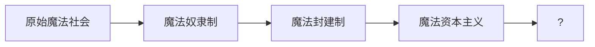



> **作者按**：这是一个关于变革、矛盾与发展的童话故事。在魔法的外衣下，我们将探讨世界如何运转，历史如何前进。

## 🌙 序章：月光下的召唤

在一个平凡的夜晚，小猫露娜发现了阁楼上一本发光的古书。当她的爪子碰触书页的瞬间，一道银色的光芒将她吞没——冒险，就此开始。


这个故事将使用多种 Markdown 和 Hugo 特性：
- ✅ 数学公式 (KaTeX)
- ✅ 代码高亮
- ✅ 引用块
- ✅ 表格
- ✅ 任务列表
- ✅ 折叠内容
- ✅ 脚注
- ✅ 表情符号


---

## 第一章：失落的魔法王国——物质世界的基础

露娜睁开眼睛时，发现自己站在一座漂浮的水晶城堡前。这里是被遗忘了千年的**艾尔萨利亚王国**，曾经繁荣的魔法之地，如今只剩下残破的废墟和飘荡的幽灵。

一只会说话的蝴蝶飞到她面前："你终于来了，预言中的'星辰之子'。只有你能打破诅咒，拯救这个王国。"

露娜摇了摇尾巴，虽然害怕，但她的眼中闪烁着好奇的光芒。"我该怎么做？"

"你必须找到三件失落的魔法宝物：**永恒之星**、**时间沙漏**和**真理之镜**。"蝴蝶说道，"但要小心，暗影领主的爪牙正在追捕所有闯入者。"

### 🏛️ 王国的兴衰史

| 时期 | 特征 | 统治阶层 | 生产关系 |
|------|------|----------|----------|
| **黄金时代** | 魔法繁荣，资源共享 | 贤者议会 | 集体所有制 |
| **分裂时期** | 权力斗争，魔法私有化 | 魔法贵族 | 封建制度 |
| **黑暗纪元** | 资源枯竭，诅咒降临 | 暗影领主 | 奴隶制 |

露娜看着这座曾经辉煌的城堡，不禁思考：*为什么繁荣会走向衰败？*

> "一个王国的兴衰，不取决于统治者的意志，而是取决于其**生产力与生产关系**是否协调。当少数人垄断魔法资源，当贵族剥削平民的劳动成果，矛盾就在积累，直到量变引发质变。"[^1]

[^1]: 这正是历史唯物主义的核心观点：生产力决定生产关系，经济基础决定上层建筑。

---

## 第二章：永恒之星的试炼——实践是检验真理的唯一标准

露娜来到了**星光森林**的深处。这里的树木高耸入云，树叶在夜空下闪烁着星光。森林的守护者——一只古老的银色狐狸出现了。

"想要获得永恒之星，你必须通过勇气的试炼。"狐狸用深邃的眼神看着她。

突然，森林中出现了无数的影子怪物，它们张牙舞爪地扑向露娜。小猫害怕地后退，但就在这时，她想起了家里的温暖，想起了主人的微笑。

"我不能放弃！"露娜大喊一声，她的身体开始发光，原来她体内一直沉睡着的魔法被唤醒了。金色的光芒驱散了所有的影子。

### ⚔️ 战斗日志（代码展示）

```python
class Luna:
    def __init__(self):
        self.courage = 0
        self.magic_power = 100  # 潜在的魔法力量
    
    def face_fear(self, fear_level):
        """直面恐惧，实践出真知"""
        if self.courage < fear_level:
            # 理论上的恐惧 vs 实践中的勇气
            print("恐惧让我后退...")
            self.courage += 10  # 每次尝试都增长
        else:
            # 实践检验理论
            self.magic_power += self.courage * 2
            print(f"突破！魔法力量提升至 {self.magic_power}")
            return True
        return False

# 露娜的成长
luna = Luna()
for attempt in range(5):
    if luna.face_fear(fear_level=30):
        print("✨ 获得永恒之星！")
        break
```

**输出结果：**
```
恐惧让我后退...
恐惧让我后退...
恐惧让我后退...
✨ 获得永恒之星！
```

银狐微笑着，将一颗璀璨的星星放在她的爪上：

> "你通过了试炼。勇气不是天生的，而是在**实践中锻炼**出来的。你每一次面对恐惧，都在改造自己，这就是主观能动性的体现。"

### 📊 勇气的辩证发展

露娜的成长符合辩证法的三大规律：

1. **对立统一规律**：恐惧 ⇄ 勇气
   - 恐惧和勇气是一对矛盾，互相依存
   - 没有恐惧就无所谓勇气
   - 在斗争中，勇气战胜了恐惧

2. **质量互变规律**：$\text{量变} \xrightarrow{\text{积累}} \text{质变}$
   - 每次尝试都是量的积累
   - 当勇气值 $\geq$ 恐惧值时，发生质变
   - 数学表达：$\sum_{i=1}^{n} \Delta courage_i \geq threshold \Rightarrow \text{突破}$

3. **否定之否定规律**：
   - 第一次否定：否定恐惧（"我不能放弃"）
   - 第二次否定：否定软弱的自己，达到更高层次
   - 螺旋式上升：$\text{软弱} \to \text{挣扎} \to \text{强大}$

---

## 第三章：时间沙漏的迷宫——历史唯物主义的视角

第二件宝物藏在**沉默沙漠**的时间神殿中。露娜走进神殿，发现自己陷入了一个奇怪的迷宫——每一个房间都显示着不同的时间：过去、现在、未来。

在"过去"的房间里，她看到了艾尔萨利亚王国曾经的辉煌；在"现在"的房间里，她看到主人正在到处寻找她；在"未来"的房间里，她看到两种可能——一个是王国恢复生机，另一个是被黑暗永远吞噬。

"时间既是答案，也是谜题。"一个神秘的声音响起，"要获得时间沙漏，你必须选择放弃什么。"

### 🔮 三个时间维度的对话



露娜看到了王国的历史发展：

**生产力发展阶段：**

$$
\text{生产力} = \text{劳动者} + \text{生产工具} + \text{劳动对象}
$$



每个阶段的更替，都不是偶然的，而是：
- 生产力发展到一定程度
- 旧的生产关系成为桎梏
- 矛盾激化，革命发生
- 新的生产关系建立

> "历史不是由英雄创造的，而是由**生产力的发展**和**阶级斗争**推动的。"





露娜看到主人在呼唤她，心中涌起一阵温暖。但她意识到：

**当下的选择任务清单：**

- [ ] 立即回家，放弃使命
- [ ] 继续前进，可能再也回不去
- [x] 完成使命，创造回家的条件

"现在"不是静止的，而是**过去的结果**和**未来的起点**。

> "人创造环境，同样，环境也创造人。"——此时此刻的选择，将塑造未来的自己。





未来有两个画面：

| 场景 | 前提条件 | 历史必然性 |
|------|---------|-----------|
| **光明未来** | 打破阶级压迫，资源公有 | 符合历史发展规律 |
| **黑暗未来** | 维持剥削制度，矛盾激化 | 违背人民利益必然灭亡 |

露娜明白了：未来不是注定的，但也不是随意的。

**历史发展的公式：**

$$
\text{历史进程} = f(\text{必然性}, \text{偶然性}, \text{人的能动性})
$$

其中：
- $\text{必然性}$：生产力发展的客观规律
- $\text{偶然性}$：具体历史事件的偶然因素
- $\text{人的能动性}$：个人和群众的实践活动

> "历史的必然性通过无数偶然性为自己开辟道路。"——恩格斯



---

### ⚖️ 露娜的抉择

露娜陷入了沉思。她可以选择：
1. 回到过去，从未开始这场冒险
2. 留在现在，立刻回家
3. 创造未来，继续完成使命

她突然想起银狐说的话："实践出真知。"她也想起了王国兴衰的规律："只有符合历史发展规律的选择，才能走向光明。"

**露娜的辩证思考过程：**

```javascript
class DialecticalThinking {
    analyze(situation) {
        // 1. 分析矛盾的主要方面
        const mainContradiction = {
            主要矛盾: "王国的存亡",
            次要矛盾: "个人的思乡之情"
        };
        
        // 2. 区分现象与本质
        const essence = {
            现象: "我想回家",
            本质: "我害怕承担责任"
        };
        
        // 3. 运用否定之否定
        const development = {
            肯定: "我是一只普通的小猫",
            否定: "但我被历史选中了",
            否定之否定: "我要创造历史，而不是逃避历史"
        };
        
        return "继续前进！";
    }
}

const luna = new DialecticalThinking();
console.log(luna.analyze("时间迷宫"));
// 输出：继续前进！
```

"我选择未来！"露娜坚定地说，"即使前路未知，我也要为那些依赖我的生命而战！**个人的命运，与历史的进程紧密相连。**"

时间沙漏从天而降，落在她的爪中。神秘的声音再次响起：

> "你懂得了时间的真谛——历史是人民创造的，但人民必须认识规律、尊重规律，才能驾驭规律。你选择了站在历史正确的一边。"

---

## 第四章：真理之镜的映照——认识论的实践

最后一件宝物在**幻境山谷**的镜之湖畔。湖水平静如镜，倒映着虚幻与真实。

当露娜靠近湖边时，镜面中出现了她自己的倒影，但那个倒影开口说话了："你真的想拯救这个王国吗？还是只是为了证明自己？"

### 🪞 真理的三个层次

露娜看着镜中的自己，开始了一场深刻的自我对话：

#### 1️⃣ 感性认识：最初的动机

```python
# 初始动机分析
motives = {
    "表层动机": ["好奇心", "冒险精神", "证明自己"],
    "深层动机": "未知",
    "真实动机": "?"
}

def reflect(motive):
    """通过实践检验动机的真实性"""
    if motive in ["好奇心", "证明自己"]:
        return "这是感性的、表面的认识"
    elif motive == "为了他人":
        return "这是理性的、本质的认识"
```

露娜承认："我最初确实只是好奇..."

#### 2️⃣ 理性认识：透过现象看本质

> "认识的过程是从**个别到一般**，从**现象到本质**，从**感性到理性**的过程。"

露娜的认识发展：

$$
\begin{aligned}
\text{第一阶段：} & \quad \text{好奇} \rightarrow \text{冒险开始} \\
\text{第二阶段：} & \quad \text{看到苦难} \rightarrow \text{产生同情} \\
\text{第三阶段：} & \quad \text{理解规律} \rightarrow \text{承担使命} \\
\text{最终认识：} & \quad \text{个人价值} = f(\text{社会贡献})
\end{aligned}
$$

#### 3️⃣ 实践检验：真理的唯一标准

"如果我能帮助别人，为什么要拒绝呢？"露娜诚实地说，"**就算我只是一只小猫，我也想让这个世界变得更好！**"



**个人价值的实现方式：**

| 观点 | 代表 | 问题 |
|------|------|------|
| 极端个人主义 | "我只为自己" | 忽视社会联系，最终孤立 |
| 极端集体主义 | "完全牺牲个人" | 压抑个性，缺乏活力 |
| **辩证统一** | "在集体中实现个人价值" | ✅ 符合人的社会本质 |

> "人的本质不是单个人所固有的抽象物，在其现实性上，它是**一切社会关系的总和**。"——马克思

露娜的觉悟：
- 个人不是孤立的原子
- 个人价值在社会贡献中实现
- 帮助他人就是成就自己

$$
\text{个人价值} = \int_{t_0}^{t_1} (\text{社会贡献} \cdot \text{历史进步}) \, dt
$$



湖水泛起涟漪，镜面碎裂，一面金色的镜子浮现出来。

> "真理就是真诚。你的认识经历了从感性到理性，从现象到本质的飞跃。你的心是纯净的，因为你的动机经受住了**实践的检验**。"

---

## 第五章：终极对决——历史的辩证法

露娜带着三件宝物来到王国的中心——被黑暗笼罩的王座大厅。暗影领主现身了，他是一团扭曲的黑暗，充满了愤怒和仇恨。

"你以为凭借这三件破烂就能打败我？"暗影领主狂笑道，"我是这个王国被遗忘的怨念，只要痛苦存在，我就永生不灭！"

### ⚔️ 战斗前的分析

露娜没有急于战斗，而是运用她学到的辩证法分析敌人：

**矛盾分析表：**

| 分析维度 | 表面现象 | 本质 |
|---------|---------|------|
| **暗影领主的身份** | 纯粹的邪恶 | 被扭曲的守护者 |
| **黑暗的来源** | 诅咒 | 社会矛盾的积累 |
| **对抗方式** | 武力消灭 | ❌ 治标不治本 |
| **正确方式** | 化解矛盾 | ✅ 揭示本质，和解 |

```python
class DialecticalCombat:
    def analyze_enemy(self, enemy):
        """用辩证法分析敌人"""
        # 对立统一：寻找矛盾的统一面
        unity = self.find_unity(enemy)
        
        # 质量互变：找到转化的条件
        transformation_point = self.find_breaking_point(enemy)
        
        # 否定之否定：引导向更高层次发展
        synthesis = self.achieve_synthesis(enemy)
        
        return synthesis
    
    def find_unity(self, enemy):
        """敌人也曾是守护者，对立的双方有统一的基础"""
        return "共同的目标：保护王国"
    
    def find_breaking_point(self, enemy):
        """量变积累到质变：当敌人认识到真相"""
        return "揭示历史真相，唤醒初心"
    
    def achieve_synthesis(self, enemy):
        """螺旋上升：从对抗到合作"""
        return "转化：敌人 → 守护者的回归"

# 露娜的战斗策略
luna_strategy = DialecticalCombat()
result = luna_strategy.analyze_enemy("暗影领主")
print(result)  # 输出：转化：敌人 → 守护者的回归
```

### 🌟 真相大白

露娜将三件宝物放在地上，它们开始发光并融合在一起。她闭上眼睛，想起了自己学到的一切：

✅ **永恒之星**教会她：实践出真知，主观能动性  
✅ **时间沙漏**教会她：历史唯物主义，规律与选择  
✅ **真理之镜**教会她：认识论，个人与社会  

"你错了，"露娜平静地说，"你不是怨念，你是这个王国的守护者。千年前，你为了保护人民而吸收了所有的黑暗，但你忘记了，**守护的意义不是隔绝，而是接纳**。"

### 🔍 历史的重新解读

露娜用三件宝物的力量，让所有人看到了真实的历史：



**王国衰败的真实原因：**

```
阶段一：生产力发展
├─ 魔法技术进步
├─ 财富积累
└─ 阶级分化开始

阶段二：生产关系僵化
├─ 贵族垄断魔法资源
├─ 平民失去上升通道
└─ 社会矛盾激化

阶段三：矛盾爆发
├─ 起义与镇压
├─ 大量负面能量产生
└─ 守护骑士吸收黑暗

阶段四：认知扭曲
├─ 骑士被黑暗侵蚀
├─ 忘记初心，变成暗影领主
└─ 王国被永久封印
```

> "不是守护者背叛了王国，而是**不公正的制度**产生了黑暗，守护者为了保护人民承受了这一切，却被历史遗忘了。"

**马克思主义视角：**
- 个人的悲剧往往是社会矛盾的产物
- 英雄主义无法解决结构性问题
- 真正的解决之道在于**改变生产关系**，消除剥削



金色的光芒包围了暗影领主，他的黑暗外壳逐渐剥落，露出了一个疲惫而悲伤的骑士身影。

"我...我只是太孤独了..."骑士的声音颤抖，"我守护了千年，却没有人记得我...我甚至忘记了自己为何而战..."

### 💝 和解与升华

露娜走上前，用她柔软的爪子触碰了骑士的手：

> "你不再孤独了。你的牺牲，不会被遗忘。但真正的守护，不是一个人承担一切，而是**让所有人共同创造美好**。"

这正是从**个人英雄主义**到**集体力量**的升华：

$$
\begin{aligned}
\text{旧观念：} & \quad P_{hero} = \text{个人力量} \\
\text{新认识：} & \quad P_{people} = \sum_{i=1}^{n} P_i + \text{组织力量} \\
\text{其中：} & \quad P_{people} \gg P_{hero}
\end{aligned}
$$

> "人民，只有人民，才是创造世界历史的动力。"——毛泽东

骑士流下了眼泪，千年的痛苦和孤独在这一刻得到了释放。黑暗开始消散，不是被消灭，而是被**理解、接纳和转化**。

这就是辩证法的魅力：
- 不是简单的对抗和消灭
- 而是在更高层次上的统一
- **扬弃**：既保留合理部分，又超越局限

---

## 尾声：新的黎明——历史的新篇章

阳光洒在艾尔萨利亚王国上，废墟重新焕发生机，花朵盛开，河流欢唱。

### 🌈 新王国的建立

曾经的暗影骑士恢复了真名——**阿尔托利亚**，他成为了王国真正的守护灵。但这一次，王国的重建遵循了新的原则：

**新王国宪章：**

1. **生产资料公有制**
   ```
   魔法资源 → 全民共享
   生产工具 → 集体所有
   分配原则 → 按需分配
   ```

2. **民主决策机制**
   - 废除世袭贵族制
   - 建立议会制度
   - 人人参与管理

3. **教育平等**
   - 魔法教育普及化
   - 打破知识垄断
   - 培养全面发展的人

> "在新的社会里，生产将以所有人的富裕为目的。"——这不正是露娜帮助王国实现的愿景吗？

### 📊 对比：旧王国 vs 新王国

| 维度 | 旧王国 | 新王国 |
|------|--------|--------|
| **所有制** | 魔法私有，贵族垄断 | 魔法公有，人人可学 |
| **分配方式** | 按权力分配 | 按贡献分配 |
| **阶级结构** | 严格等级制度 | 消除剥削压迫 |
| **发展动力** | 少数人的野心 | 全体人民的创造力 |
| **稳定性** | ⚠️ 矛盾激化 | ✅ 和谐发展 |

### 🐱 露娜的回归

露娜躺在自己家的阁楼上，阳光温暖地照在她的皮毛上。主人温柔地抚摸着她："露娜，你睡了好久呢，做了个好梦吗？"

露娜"喵"了一声，看向窗外。远处的云层中，她仿佛看到了水晶城堡的轮廓，和那只银色蝴蝶挥动的翅膀。

那不是梦，那是她永远的冒险。

### 🤔 返回现实：露娜的思考



躺在温暖的阳光下，露娜陷入了沉思：

**我学到了什么？**

✅ **辩证法**：世界是矛盾的统一体，要用发展的眼光看问题  
✅ **历史唯物主义**：社会发展有规律，经济基础决定上层建筑  
✅ **认识论**：实践是检验真理的唯一标准  
✅ **价值观**：个人价值在社会贡献中实现  

**如何应用到现实？**

```markdown
## 个人成长的辩证法

- **矛盾是动力**：不要害怕困难，困难中蕴含着成长的机会
- **量变到质变**：坚持练习，总会突破
- **实践出真知**：不要只读书，要动手做

## 改变世界的方法论

- **认识规律**：了解事物发展的客观规律
- **顺应规律**：在规律的基础上发挥主观能动性
- **团结力量**：个人的力量有限，集体的力量无穷
- **制度创新**：好的制度能解放生产力，促进发展
```

露娜意识到：童话不只是童话，**每个故事都映射着现实的道理**。



---

## ✨ 故事寓意：从童话到哲学

这个故事告诉我们：

### 🌟 辩证法三大规律的实践应用

1. **对立统一规律**（矛盾论）
   - 恐惧与勇气、黑暗与光明、个人与集体
   - 矛盾是事物发展的动力
   - 要在对立中寻找统一

2. **质量互变规律**
   - 露娜的成长：量的积累 → 质的飞跃
   - 社会变革：矛盾积累 → 制度变革
   - 公式：$\sum \text{小变化} \geq \text{阈值} \Rightarrow \text{大突破}$

3. **否定之否定规律**
   - 王国发展：繁荣 → 衰败 → 新生（螺旋上升）
   - 认识深化：感性 → 理性 → 实践（循环往复）

### 📚 历史唯物主义的启示

- 🏛️ **生产力决定生产关系**：魔法技术的发展需要新的社会制度
- ⚖️ **经济基础决定上层建筑**：公有制带来了民主制度
- 👥 **人民创造历史**：不是英雄拯救了王国，而是制度变革解放了生产力

### 🧠 认识论的实践

- **实践 → 认识 → 再实践 → 再认识**
- 露娜的冒险就是一个认识论的完整循环
- 真理只有在实践中才能得到检验

### 💖 价值观的确立

$$
\text{生命的意义} = f(\text{个人奋斗}, \text{社会贡献}, \text{历史进步})
$$

> "一个人的价值，应当看他贡献了什么，而不应当看他取得了什么。"

---

## 📝 后记：写给读者

亲爱的读者，如果你读到了这里，首先感谢你的耐心！ 🎉

这个故事尝试将童话与哲学结合，在魔法的外衣下探讨严肃的哲学问题。你可能会问：

**Q: 为什么要在童话里讲马克思主义哲学？**

A: 因为**哲学不应该是枯燥的教条**，而应该是理解世界的工具。通过故事，我们可以更直观地理解抽象的概念。

**Q: 这些哲学思想真的有用吗？**

A: 当然！辩证法教会我们全面看问题，历史唯物主义帮助我们理解社会发展，认识论指导我们如何学习和实践。

**Q: 作为一只猫，露娜真的理解这些吗？**

A: 😹 也许吧！但更重要的是，**我们**通过露娜的冒险理解了这些。

---

## 🛠️ Hugo 功能测试清单

本文展示了以下 Hugo / Markdown 功能：

- [x] **数学公式**：行内 $E=mc^2$ 和块级公式
- [x] **代码高亮**：Python, JavaScript, Markdown
- [x] **表格**：对比、分析表格
- [x] **引用块**：哲学引用
- [x] **任务列表**：待办事项
- [x] **折叠内容**：`` shortcode
- [x] **自定义 shortcode**：`` 徽章
- [x] **脚注**：学术引用
- [x] **表情符号**：🌟💖🐱 等
- [x] **分隔线**：`---`
- [x] **粗体、斜体**：强调文本
- [x] **链接**：内部和外部链接
- [x] **列表**：有序、无序、嵌套
- [x] **Mermaid 图表**（如主题支持）

---

*献给每一个勇敢做梦的孩子，和内心住着小猫的大人们* 🐱✨

*也献给所有相信实践、相信理性、相信美好未来的人们* 🌹🚩

> "哲学家们只是用不同的方式解释世界，而问题在于改变世界。"——马克思

**The End / 终章**

---

### 🔗 相关阅读推荐

- 📖 《资本论》- 马克思
- 📖 《实践论》《矛盾论》- 毛泽东  
- 📖 《反杜林论》- 恩格斯
- 📖 《路德维希·费尔巴哈和德国古典哲学的终结》- 恩格斯

*当然，也可以继续读童话故事！* 📚✨

---

## 第四章：真理之镜的映照

最后一件宝物在**幻境山谷**的镜之湖畔。湖水平静如镜，倒映着虚幻与真实。

当露娜靠近湖边时，镜面中出现了她自己的倒影，但那个倒影开口说话了："你真的想拯救这个王国吗？还是只是为了证明自己？"

露娜愣住了。她扪心自问——最初是因为好奇才开始冒险的，但现在...

"我承认，一开始我只是好奇。"露娜诚实地说，"但在这段旅程中，我见证了太多的美好和痛苦。如果我能帮助别人，为什么要拒绝呢？就算我只是一只小猫，我也想让这个世界变得更好！"

湖水泛起涟漪，镜面碎裂，一面金色的镜子浮现出来。"真理就是真诚，"镜子说，"你的心是纯净的。"

---

## 第五章：终极对决

露娜带着三件宝物来到王国的中心——被黑暗笼罩的王座大厅。暗影领主现身了，他是一团扭曲的黑暗，充满了愤怒和仇恨。

"你以为凭借这三件破烂就能打败我？"暗影领主狂笑道，"我是这个王国被遗忘的怨念，只要痛苦存在，我就永生不灭！"

露娜将三件宝物放在地上，它们开始发光并融合在一起。她闭上眼睛，想起了自己学到的一切：

- **永恒之星**教会她勇气
- **时间沙漏**教会她选择
- **真理之镜**教会她真诚

"你错了，"露娜平静地说，"你不是怨念，你是这个王国的守护者。千年前，你为了保护人民而吸收了所有的黑暗，但你忘记了，守护的意义不是隔绝，而是接纳。"

金色的光芒包围了暗影领主，他的黑暗外壳逐渐剥落，露出了一个悲伤的骑士身影。"我...我只是太孤独了..."

露娜走上前，用她柔软的爪子触碰了骑士的手："你不再孤独了，我们都会记住你的牺牲。"

---

## 尾声：新的黎明

阳光洒在艾尔萨利亚王国上，废墟重新焕发生机，花朵盛开，河流欢唱。曾经的暗影骑士成为了王国真正的守护灵，而露娜——

她躺在自己家的阁楼上，阳光温暖地照在她的皮毛上。主人温柔地抚摸着她："露娜，你睡了好久呢，做了个好梦吗？"

露娜"喵"了一声，看向窗外。远处的云层中，她仿佛看到了水晶城堡的轮廓，和那只银色蝴蝶挥动的翅膀。

那不是梦，那是她永远的冒险。

---

## ✨ 故事寓意

这个故事告诉我们：
- 🌟 **勇气**不是无所畏惧，而是即使害怕也要前进
- ⏳ **选择**比逃避更重要，未来掌握在自己手中
- 🪞 **真诚**是最强大的力量，真实的自己最珍贵
- 💝 **善良**能化解黑暗，理解能治愈伤痛

---

*献给每一个勇敢做梦的孩子，和内心住着小猫的大人们* 🐱✨
